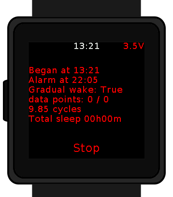
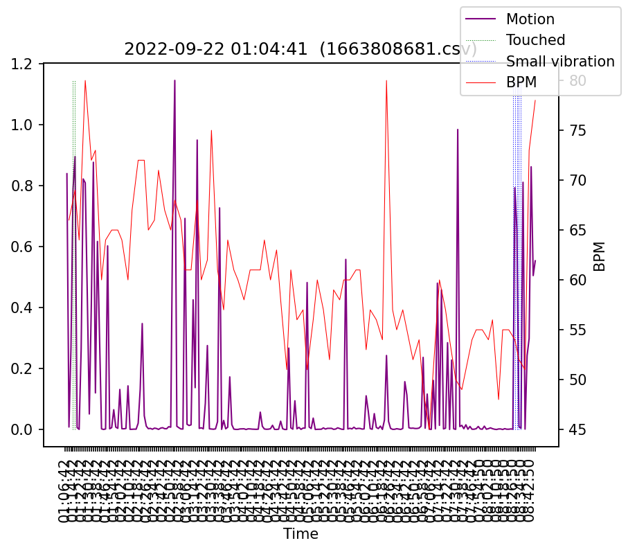

# SleepTk : a sleep tracker and smart alarm for wasp-os
**Goal:** privacy friendly sleep tracker with cool alarm features for the [pinetime smartwatch](https://pine64.com/product/pinetime-smartwatch-sealed/) by Pine64, on python, to run on [wasp-os](https://github.com/daniel-thompson/wasp-os).

## Features:
* **Privacy friendly**: your data is not sent to anyone, it is stored directly on the watch (but you can still download it if needed).
* **Fully open source**
* **Easy to snooze but hard to stop** You have to swipe several times to make it stop, but can snooze easily.
* **Optimized for waking up refreshed**: suggests wake up time according to average sleep cycles length.
* **Gradual wake**: vibrates the watch a tiny bit a few times before the alarm to lift you gently back to consciousness.
* **Natural wake**: small vibration every 30s until you wake up, instead of a full blown alarm.
* **Insomnia insights**: if you turn on the screen during the night, SleepTk will tell you how long you slept and in what part of the sleep cycle you are supposed to be. Helpful to figure out insomnia patterns.
* **Body tracking**: logs your body movement during the night, infers your sleep cycle and write it all down in a `.csv` file.
* **Heart tracking**: tracks your heart rate throughout the night. *(edit: will be vastly improved when [this issue][https://github.com/daniel-thompson/wasp-os/pull/363#issuecomment-1257055637) gets sorted out)*
* **Status: fully functional**

## Credits:
* Many thanks to Emanuel Löffler (https://github.com/plan5) who kindly created the logo.

### Note to reader:
* Note that the watch assumes that you fall asleep instantly. Previously an average of 14 minutes to fall asleep was taken into account but now you have to adjust yourself depending on how sleepy you are.
* If you're interested or have any kind of things to say about this, **please** open an issue and tell me all about it :)
* you can download your sleep data file using the file `pull_sleep_data`. An old workflow to load data into [pandas](https://pypi.org/project/pandas/) can be found at the bottom of this README. A more recent quick and dirty loader can be found in `plotter.py`.
* Notifications are set to "silent" during the tracking session and are restored to the previously used level when the alarm is ringing
* In the settings you can tell the Bluetooth to turn off automatically at the beginning of the night. This can save battery but will stop any attempt at downloading the latest data as long as you have not restarted the watch.
* It seems the simulator is having a rough time with daylight saving mode or time management. I personally get a 1h offset between sleep estimation on the simulator compared to the pinetime, don't worry it works fine on the watch.
* If your watch's storage is full because of all the logging files, follow [these instructions to reset the storage](https://github.com/daniel-thompson/wasp-os/issues/345#issuecomment-1194270674).
* Previously, SleepTk included a feature to compute the best alarm best on the estimated sleep cycle from your body movements and heart tracking but counting the cycles is already so much efficient that this ended up removed!
* To download your sleep data: use the script `pull_sleep_data.py`. It can be run automatically every day for example and will automatically remove recordings from the watch*
* Button pressing during the night are logged, this can be used for example in lucid dreaming, to figure out details about insomnias, to estimate duration between events during the night, to name a few.
* The logs are stored in `/logs/sleep/T_F_V.csv`. `T` is the timestamps of the start of the tracking session and `F` the frequency of the savings (this way each line just contains the number of frequency cycle elapsed, saving precious space.) `V` stands for version and is used just in case the naming convention changes.

# Screenshots:





## TODO
**misc**
* ask someone to move the icon a bit to the right, it is currently not centered
* print the number of cycle left to sleep when waking up in the middle of the night
* greatly simplify the code by simply adding a large tick function every second instead of managing tons of counters.
* investigate adding a simple feature to wake you up only after a certain movement threshold was passed
* add a "nap tracking" mode that records sleep tracking with more precision
    * add a "power nap" mode that wakes you as soon as there has been no movement for 5 minutes OR (like steelball) when your heart rate drops
* investigate if the hardware method behind lift to wake can be used to detect motion throughout the night

* ability to send in real time to Bluetooth device the current sleep stage you're probably in. For use in Targeted Memory Reactivation?

## Bibliography and related links:
* [Estimating sleep parameters using an accelerometer without sleep diary](https://www.nature.com/articles/s41598-018-31266-z)
* [Sleep stage prediction with raw acceleration and photoplethysmography heart rate data derived from a consumer wearable device](https://academic.oup.com/sleep/article/42/12/zsz180/5549536)
* [Towards Benchmarked Sleep Detection with Wrist-Worn Sensing Units](https://ieeexplore.ieee.org/document/7052479)

### to read :
* [Sleep classification from wrist-worn accelerometer data using random forests](https://pubmed.ncbi.nlm.nih.gov/33420133/)
* [Sleep Monitoring Based on a Tri-Axial Accelerometer and a Pressure Sensor](https://www.mdpi.com/1424-8220/16/5/750)
* [A Sleep Monitoring Application for u-lifecare Using Accelerometer Sensor of Smartphone](https://link.springer.com/chapter/10.1007/978-3-319-03176-7_20)
* [The Promise of Sleep: A Multi-Sensor Approach for Accurate Sleep Stage Detection Using the Oura Ring](https://www.mdpi.com/1424-8220/21/13/4302)
* [Validation of an Accelerometer Based BCG Method for Sleep Analysis](https://aaltodoc.aalto.fi/handle/123456789/21176)
* [Accelerometer-based sleep analysis](https://patents.google.com/patent/US20140364770A1/en)
* [Performance comparison between wrist and chest actigraphy in combination with heart rate variability for sleep classification](https://www.sciencedirect.com/science/article/pii/S0010482517302597)
* [Estimation of sleep stages in a healthy adult population from optical plethysmography and accelerometer signals](https://iopscience.iop.org/article/10.1088/1361-6579/aa9047/meta)
* [SleepPy: A python package for sleep analysis from accelerometer data](https://joss.theoj.org/papers/10.21105/joss.01663.pdf)

### Related project:
* another hackable smartwatch has a similar software: [sleepphasealarm](https://banglejs.com/apps/#sleepphasealarm) and [steelball](https://github.com/jabituyaben/SteelBall) for the [Banglejs](https://banglejs.com/)


## Pandas integration:
Commands the author uses to take a look a the data using pandas:

```
fname = "./logs/sleep/YOUR_TIME.csv"

import pandas as pd
import plotly.express as plt

#df = pd.read_csv(fname, names=["motion", "elapsed", "x_avg", "y_avg", "z_avg", "battery"])
df = pd.read_csv(fname, names=["motion", "elapsed", "heart_rate"])
start_time = int(fname.split("/")[-1].split(".csv")[0])

df["time"] = pd.to_datetime(df["elapsed"]+start_time, unit='s')
df["human_time"] = df["time"].dt.time

month = df.iloc[0]["time"].month_name()
dayname = str(df.iloc[0]["time"].day_name())
daynumber = str(df.iloc[0]["time"].day)
if daynumber == 1:
    daynumber = str(daynumber) + "st"
elif daynumber.endswith("2"):
    daynumber = str(daynumber) + "nd"
elif daynumber.endswith("3"):
    daynumber = str(daynumber) + "rd"
else:
    daynumber = str(daynumber) + "th"
date = f"{month} {daynumber} ({dayname})"

fig = px.line(df,
              x="time",
              y="motion",
              labels={"motion": "Body motion", "time":"Time"},
              title=f"Night starting on {date}")
fig.update_xaxes(type="date",
                 tickformat="%H:%M"
                 )
fig.show()

df_HR = df.set_index("human_time")["heart_rate"]
df_HR = df_HR[~df_HR.isna()]
df_HR.plot()

```

Now, to play around with the signal processing function:
```
import array
data = array.array("f", df["motion"])
data = data[:15] # remove the last few data points as the signal
# processor does not yet have access to them when finding best wake up time


##############################################
### PUT LATEST SIGNAL PROCESSING CODE HERE ###
##############################################


from matplotlib import pyplot as plt
plt.plot(data)
for i in x_maximas:
    plt.axvline(x=i,
                color="red",
                linestyle="--"
                )
plt.show()
```
