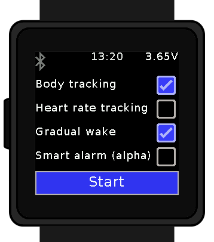

# SleepTk : a sleep tracker and smart alarm for wasp-os
**Goal:** privacy friendly sleep tracker with smart alarm for the [pinetime smartwatch](https://pine64.com/product/pinetime-smartwatch-sealed/) by Pine64, on python, to run on [wasp-os](https://github.com/daniel-thompson/wasp-os).

## Features:
* **sleep tracking**: logs your movement during the night, infers your sleep cycle and write it all down in a `.csv` file
* **Flexible**: does not make too many assumption regarding time to fall asleep, sleep cycle duration etc. SleepTk tries various data to see what fits best for your profile. If you still want to customize things, all the hardcoded and commented settings are easily accessible at the top of the file.
* **suggested alarm clock**: suggests wake up time according to average sleep cycles length
* **gradual alarm clock**: vibrates the watch a tiny bit a few times before the alarm to lift you gently back to consciousness
* **smart alarm clock (alpha)**: adaptative alarm that wakes you up to 40 minutes before the set time to make sure you wake up feeling refreshed.
* **privacy friendly**: your data is not sent to anyone, it is stored and analyzed directly on the watch (but you can still download if if needed)
* open source

## **How to install**:
*(for now you need my slightly forked wasp-os that allows to use accelerometer data)*
* download the latest [forked wasp-os](https://github.com/thiswillbeyourgithub/wasp-os)
* download the latest [SleepTk.py](./SleepTk.py)
* put the latest app in `wasp-os/wasp/apps/SleepTk.py`
* compile `wasp-os`: `make submodules && make softdevice && make BOARD=pinetime all && echo "SUCCESS"`
* upload it to your pinetime: `./tools/ota-dfu/dfu.py -z build-pinetime/micropython.zip -a XX:XX:XX:XX:XX:XX --legacy`
* reboot the watch and enjoy `SleepTk`
* *optional: download your latest sleep data using the script `pull_latest_sleep_data.py`*

### Note to reader:
* If you're interested or have any kind of things to say about this, **please** open an issue and tell me all about it :)
* Status as of end of February 2022: *UI (**done**), regular alarm (**done**), smart alarm (**mostly done but untested**)*
* you can download your sleep data file using the file `pull_latest_sleep_data`. A suggested workflow to load it into [pandas](https://pypi.org/project/pandas/) can be found at the bottom of the page.
* the notifications are set to "silent" during the tracking session and are restored to the previously used level when the alarm is ringing

# Screenshots:





## TODO
**misc**
* remove duplicate variables that store spinner values
* investigate adding snooze feature like in the original `alarms.py` app
* investigate adding a simple feature to wake you up only after a certain movement threshold was passed
* add a "nap tracking" mode that records sleep tracking with more precision
    * add a "power nap" mode that wakes you as soon as there has been no movement for 5 minutes OR (like steelball) when your heart rate drops
* implement downsampling to 15 minutes precision to compute best wake up time
* if self.foreground is called, record the time. Use it to cancel smart alarm if you woke up too many times (more than 2 times in more than 20 minutes apart).

* log smart alarm data to file? log user rating of how well he/she felt fresh at wake?
* ability to send in real time to Bluetooth device the current sleep stage you're probably in. For use in Targeted Memory Reactivation?

## Bibliography and related links:
* [Estimating sleep parameters using an accelerometer without sleep diary](https://www.nature.com/articles/s41598-018-31266-z)
* [Sleep stage prediction with raw acceleration and photoplethysmography heart rate data derived from a consumer wearable device](https://academic.oup.com/sleep/article/42/12/zsz180/5549536)
* [Towards Benchmarked Sleep Detection with Wrist-Worn Sensing Units](https://ieeexplore.ieee.org/document/7052479)

### to read :
* [Sleep classification from wrist-worn accelerometer data using random forests](https://pubmed.ncbi.nlm.nih.gov/33420133/)
* [Sleep Monitoring Based on a Tri-Axial Accelerometer and a Pressure Sensor](https://www.mdpi.com/1424-8220/16/5/750)
* [A Sleep Monitoring Application for u-lifecare Using Accelerometer Sensor of Smartphone](https://link.springer.com/chapter/10.1007/978-3-319-03176-7_20)
* [The Promise of Sleep: A Multi-Sensor Approach for Accurate Sleep Stage Detection Using the Oura Ring](https://www.mdpi.com/1424-8220/21/13/4302)
* [Validation of an Accelerometer Based BCG Method for Sleep Analysis](https://aaltodoc.aalto.fi/handle/123456789/21176)
* [Accelerometer-based sleep analysis](https://patents.google.com/patent/US20140364770A1/en)
* [Performance comparison between wrist and chest actigraphy in combination with heart rate variability for sleep classification](https://www.sciencedirect.com/science/article/pii/S0010482517302597)
* [Estimation of sleep stages in a healthy adult population from optical plethysmography and accelerometer signals](https://iopscience.iop.org/article/10.1088/1361-6579/aa9047/meta)
* [SleepPy: A python package for sleep analysis from accelerometer data](https://joss.theoj.org/papers/10.21105/joss.01663.pdf)

### Related project:
* another hackable smartwatch has a similar software: [sleepphasealarm](https://banglejs.com/apps/#sleepphasealarm) and [steelball](https://github.com/jabituyaben/SteelBall) for the [Banglejs](https://banglejs.com/)


## Pandas integration:
Commands the author uses to take a look a the data using pandas:

```
fname = "./logs/sleep/YOUR_TIME.csv"

import pandas as pd
import plotly.express as plt

df = pd.read_csv(fname, names=["motion", "elapsed", "x_avg", "y_avg", "z_avg", "battery"])
start_time = int(fname.split("/")[-1].split(".csv")[0])

df["time"] = pd.to_datetime(df["elapsed"]+start_time, unit='s')
df["human_time"] = df["time"].dt.time

month = df.iloc[0]["time"].month_name()
dayname = str(df.iloc[0]["time"].day_name())
daynumber = str(df.iloc[0]["time"].day)
if daynumber == 1:
    daynumber = str(daynumber) + "st"
elif daynumber.endswith("2"):
    daynumber = str(daynumber) + "nd"
elif daynumber.endswith("3"):
    daynumber = str(daynumber) + "rd"
else:
    daynumber = str(daynumber) + "th"
date = f"{month} {daynumber} ({dayname})"

fig = px.line(df,
              x="time",
              y="motion",
              labels={"motion": "Body motion", "time":"Time"},
              title=f"Night starting on {date}")
fig.update_xaxes(type="date",
                 tickformat="%H:%M"
                 )
fig.show()
```

Now, to play around with the signal processing function:
```
import array
data = array.array("f", df["motion"])
data = data[:15] # remove the last few data points as the signal
# processor does not yet have access to them when finding best wake up time


##############################################
### PUT LATEST SIGNAL PROCESSING CODE HERE ###
##############################################


from matplotlib import pyplot as plt
plt.plot(data)
for i in x_maximas:
    plt.axvline(x=i,
                color="red",
                linestyle="--"
                )
plt.show()
```
